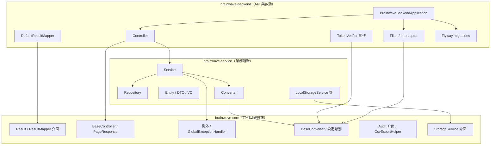
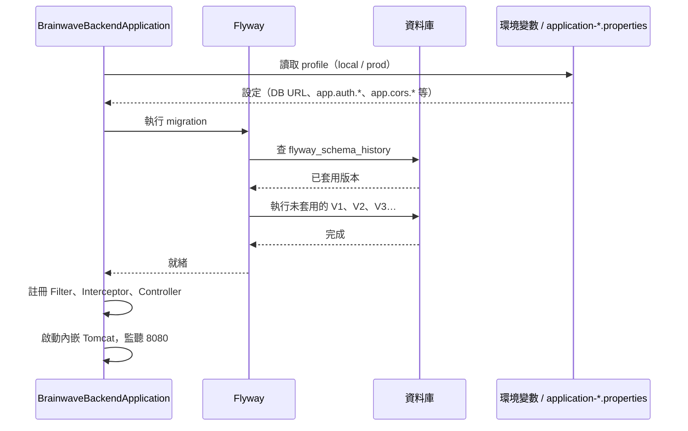
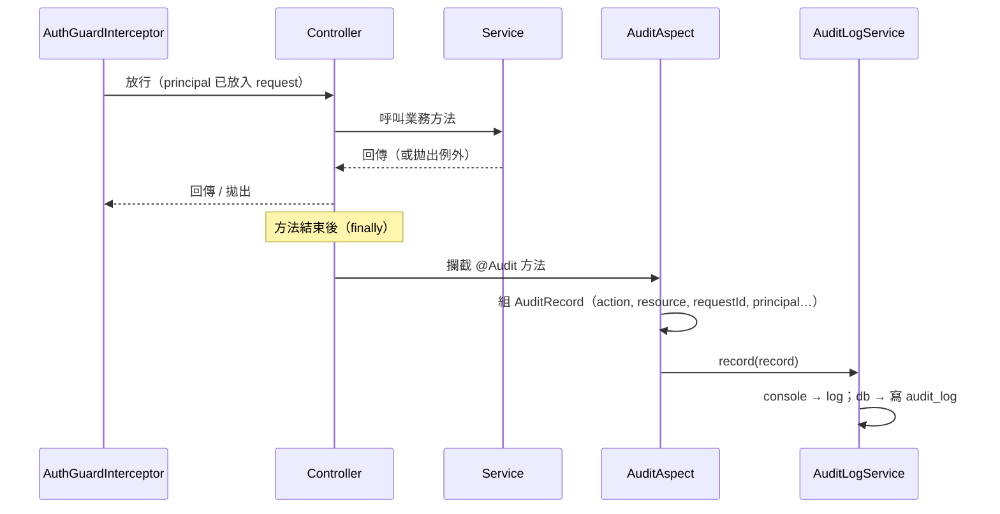

# 架構與請求流程（完整版）

本文件以圖與要點說明請求從進到出的完整路徑、三層模組關係、以及啟動與設定如何銜接。細節名詞與實作見 **本專案後台介紹.md** 各節與 **docs/** 對應說明檔。

---

## 1. HTTP 請求完整流程

下圖涵蓋：追蹤 ID、CORS、Guard、Controller/Service、成功與例外回應、以及標了 `@Audit` 時的稽核寫入。

```mermaid
flowchart TB
    subgraph 進入
        A[HTTP 請求] --> B[CorrelationIdFilter]
        B --> B1[產生/沿用 X-Request-ID<br>寫入 MDC]
        B1 --> C[CORS 檢查]
    end

    subgraph CORS
        C --> C1{來源是否允許?}
        C1 -->|否| R1[403 Forbidden]
        C1 -->|是| D[AuthGuardInterceptor]
    end

    subgraph Guard
        D --> D1{路徑需驗證?}
        D1 -->|否| E[Controller]
        D1 -->|是| D2{有 Bearer Token?}
        D2 -->|否| R2[401 Unauthorized]
        D2 -->|是| D3[TokenVerifier 驗證]
        D3 --> D4{scope/role 符合?}
        D4 -->|否| R2
        D4 -->|是| D5[principal 放入 request]
        D5 --> E
    end

    subgraph 業務
        E --> E1[呼叫 Service]
        E1 --> F[Service 層]
        F --> F1[Repository / 其他]
        F1 --> F
        F --> E
    end

    subgraph 回應
        E --> E2{有例外?}
        E2 -->|是| G[GlobalExceptionHandler]
        G --> G1[轉成統一錯誤格式]
        G1 --> R3[錯誤回應]
        E2 -->|否| H[ResultMapper 組裝 Result]
        H --> H1[帶入 correlationId]
        H1 --> R4[成功回應]
    end

    subgraph 稽核［若方法有 @Audit］
        E -.->|方法執行後| I[AuditAspect]
        I --> I1[組 AuditRecord]
        I1 --> I2{app.audit.sink?}
        I2 -->|console| I3[ConsoleAuditLogService]
        I2 -->|db| I4[DbAuditLogService]
        I3 --> I5[寫 log]
        I4 --> I6[寫 audit_log 表]
    end
```

**流程摘要**：

| 階段 | 元件 | 失敗或例外時 |
|------|------|--------------|
| 追蹤 | CorrelationIdFilter | 無，必過；僅寫入 ID |
| 跨域 | CORS（CorsConfig） | 來源不在白名單 → 403 |
| 權限 | AuthGuardInterceptor | 缺 token 或驗證失敗 / role 不符 → 401 |
| 業務 | Controller → Service | 拋出例外 → GlobalExceptionHandler → 統一錯誤回應 |
| 稽核 | AuditAspect（AOP） | 僅在方法有 `@Audit` 且 `app.audit.enabled=true` 時執行，不影響回應 |

---

## 2. 三層模組關係

依賴方向：**backend → service → core**。backend 是可執行模組；service 與 core 為程式庫。



**各層職責簡表**：

| 模組 | 職責 | 典型內容 |
|------|------|----------|
| **backend** | 接收 HTTP、組裝回應、註冊 Filter/Guard、啟動應用 | Controller、AuthGuardInterceptor、CorrelationIdFilter、JwtTokenVerifier、WebMvcConfig、db/migration |
| **service** | 業務規則、資料存取、轉換 | UserService、SystemConfigService、Entity、Repository、Converter、LocalStorageService |
| **core** | 共用契約與工具，不依賴 service/backend | Result、ResultMapper、BaseController、GlobalExceptionHandler、AuthProperties、AuditAspect、CsvExportHelper、StorageService 介面 |

---

## 3. 啟動時發生什麼（含 Flyway）



- **設定來源**：環境變數（部署時）→ `application-{profile}.properties` → 程式透過 `@ConfigurationProperties` 型別化物件存取（如 AuthProperties、CorsProperties）。
- **Flyway**：啟動時依 `db/migration/` 內檔名順序執行尚未套用的 migration，建立或更新表；不會重跑已記錄的版本。

---

## 4. 稽核與請求的關係（時序）

標了 `@Audit` 的方法在**正常執行完或拋出例外後**都會由 AOP 寫入一筆稽核；不影響回傳值與例外傳遞。



---

## 5. 與其他文件的對應

| 本文件圖／節 | 對應說明 |
|--------------|----------|
| §1 請求流程 | 認證與 Token：**認證與Token說明.md**；權限路徑：**權限守衛與RBAC說明.md**；例外與回應：**統一回應格式說明.md**；稽核：**稽核日誌說明.md**；追蹤 ID：**請求追蹤說明.md** |
| §2 三層模組 | **專案目錄結構.md**、**本專案後台介紹.md** §5.13 |
| §3 啟動與 Flyway | **資料庫遷移說明.md**、**設定治理說明.md**、**後端部署指南.md** |
| §4 稽核時序 | **稽核日誌說明.md** |

若需單一入口，請從 **本專案後台介紹.md** 的「架構總覽」進入，該節已連結本文件。
